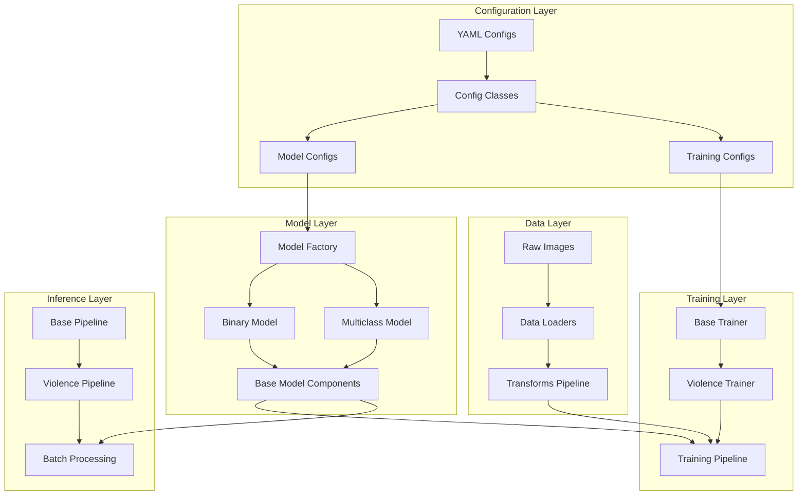
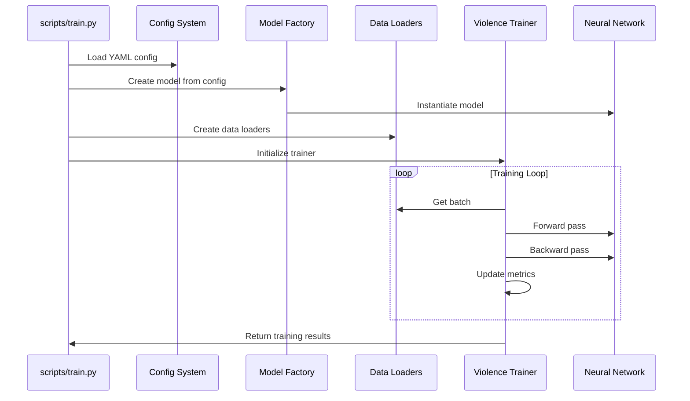
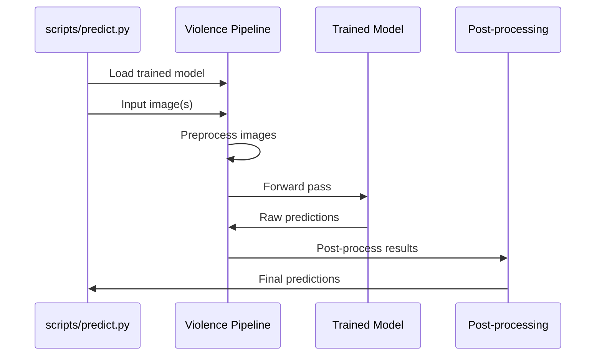

# Architecture Documentation

## System Overview

EPRA Image Classifier implements a modular MLOps architecture designed for scalable violence detection in images. The system follows modern software engineering principles with clear separation of concerns, configurable components, and production-ready pipelines.

## High-Level Architecture



## Directory Structure & Responsibilities

### `/src/epra_classifier/` - Core Package

The main package implementing all system functionality following Python best practices.

#### `/src/epra_classifier/models/` - Model Architecture Layer

Contains all neural network architectures and model-related components.

```
models/
├── __init__.py                    # Package exports
├── model_factory.py              # Centralized model creation
├── base/                          # Shared base classes
│   ├── __init__.py
│   ├── base_model.py             # Abstract base model
│   └── base_pipeline.py          # Abstract inference pipeline
├── binary/                        # Binary classification models
│   ├── __init__.py
│   └── binary_model.py           # ResNet18-based binary classifier
└── multiclass/                    # Multi-level classification models
    ├── __init__.py
    └── multiclass_model.py        # EfficientNet-based multiclass classifier
```

**Key Components:**

- **`model_factory.py`**: Factory pattern for model instantiation based on configuration
- **`base_model.py`**: Abstract base class defining common model interface
- **`binary_model.py`**: ResNet18 with spatial attention for binary violence detection
- **`multiclass_model.py`**: EfficientNet-B0 with advanced attention mechanisms

**Design Patterns:**
- Factory pattern for model creation
- Template method pattern in base classes
- Strategy pattern for different attention mechanisms

#### `/src/epra_classifier/data/` - Data Processing Layer

Handles all data loading, preprocessing, and augmentation operations.

```
data/
├── __init__.py
├── loaders/                       # Dataset loading logic
│   ├── __init__.py
│   ├── base_dataset.py           # Abstract dataset base class
│   ├── violence_dataset.py       # Violence-specific dataset
│   └── dataloader_factory.py     # DataLoader creation utility
└── transforms/                    # Image preprocessing pipeline
    ├── __init__.py
    ├── image_transforms.py        # Comprehensive transform pipeline
    └── augmentation_mixers.py     # Advanced augmentation (MixUp, CutMix)
```

**Key Components:**

- **`base_dataset.py`**: PyTorch Dataset base class with common functionality
- **`violence_dataset.py`**: Specialized dataset for violence detection tasks
- **`image_transforms.py`**: Unified transform pipeline supporting both Albumentations and torchvision
- **`augmentation_mixers.py`**: Advanced augmentation techniques for improved generalization

**Features:**
- Automatic dataset structure detection
- Configurable preprocessing pipelines
- Advanced augmentation strategies
- Multi-backend transform support

#### `/src/epra_classifier/training/` - Training System

Implements the complete training pipeline with modern ML practices.

```
training/
├── __init__.py
└── trainers/                      # Training implementations
    ├── __init__.py
    ├── base_trainer.py           # Abstract trainer base class
    └── violence_trainer.py       # Violence-specific training logic
```

**Key Components:**

- **`base_trainer.py`**: Abstract trainer with common training functionality
  - Optimizer and scheduler management
  - Checkpointing and model saving
  - Metrics tracking and logging
  - Early stopping implementation

- **`violence_trainer.py`**: Specialized trainer for violence detection
  - Class weight calculation for imbalanced datasets
  - Violence-specific metrics computation
  - Advanced augmentation integration
  - Mixed precision training support

**Training Features:**
- Mixed precision training for efficiency
- Automatic class balancing
- Comprehensive metrics tracking
- TensorBoard integration
- Early stopping with patience
- Learning rate scheduling

#### `/src/epra_classifier/inference/` - Inference Pipeline

Production-ready inference system for deployed models.

```
inference/
├── __init__.py
├── base_pipeline.py              # Abstract inference pipeline
└── violence_pipeline.py          # Violence detection inference
```

**Key Components:**

- **`base_pipeline.py`**: Abstract inference pipeline base
- **`violence_pipeline.py`**: Specialized inference for violence detection
  - Batch processing capabilities
  - Confidence filtering
  - Performance monitoring
  - Model warmup

**Inference Features:**
- Efficient batch processing
- Model export (TorchScript, ONNX)
- Performance profiling
- Confidence-based filtering
- Memory-efficient processing

#### `/src/epra_classifier/utils/` - Utility Layer

Common utilities and helper functions used across the system.

```
utils/
├── __init__.py
├── config.py                     # Configuration management
├── helpers.py                    # General utility functions
├── metrics.py                    # Evaluation metrics
├── visualization.py              # Plotting and visualization
└── logging_config.py             # Logging configuration
```

**Key Components:**

- **`config.py`**: Dataclass-based configuration system
- **`helpers.py`**: Device management, file operations, etc.
- **`metrics.py`**: Violence-specific evaluation metrics
- **`visualization.py`**: Plotting utilities for analysis
- **`logging_config.py`**: Centralized logging setup

### `/scripts/` - Command-Line Interface

User-facing scripts providing the main system interface.

```
scripts/
├── train.py                      # Model training script
├── predict.py                    # Inference script
├── evaluate.py                   # Model evaluation script
├── reclassify_images.py          # Score-to-category conversion
├── extract_features.py           # Feature extraction utility
└── create_test_subset.py         # Testing data creation
```

**Script Responsibilities:**

- **`train.py`**: Orchestrates the complete training process
- **`predict.py`**: Handles single/batch inference requests
- **`evaluate.py`**: Comprehensive model evaluation
- **`reclassify_images.py`**: Converts binary scores to multiclass categories
- **`extract_features.py`**: Extracts feature vectors for analysis

### `/configs/` - Configuration Management

YAML-based configuration system for different model types and training scenarios.

```
configs/
├── binary_config.yaml            # Binary model configuration
└── multiclass_config.yaml        # Multiclass model configuration
```

**Configuration Structure:**
```yaml
# Example configuration sections
data:          # Data loading and preprocessing
model:         # Model architecture parameters
training:      # Training hyperparameters
evaluation:    # Evaluation settings
logging:       # Logging configuration
```

### `/tests/` - Test Suite

Comprehensive testing framework ensuring system reliability.

```
tests/
├── __init__.py
├── test_models.py                # Model architecture tests
├── test_data.py                  # Data pipeline tests
├── test_training.py              # Training pipeline tests
├── test_inference.py             # Inference pipeline tests
└── fixtures/                     # Test data and utilities
```

### `/notebooks/` - Analysis & Exploration

Jupyter notebooks for data analysis, model exploration, and result visualization.

```
notebooks/
├── data_exploration.ipynb        # Dataset analysis
├── model_analysis.ipynb          # Model behavior analysis
├── training_analysis.ipynb       # Training process analysis
└── results_visualization.ipynb   # Results and metrics visualization
```

## Data Flow Architecture

### Training Flow



### Inference Flow



## Design Principles

### 1. Modularity
- Each component has a single, well-defined responsibility
- Clear interfaces between layers
- Easy to test and maintain individual components

### 2. Configurability
- YAML-based configuration system
- Runtime parameter modification
- Environment-specific configurations

### 3. Extensibility
- Abstract base classes for easy extension
- Factory patterns for adding new models
- Plugin-like architecture for new features

### 4. Production Readiness
- Comprehensive error handling
- Performance monitoring
- Memory-efficient processing
- Model export capabilities

### 5. MLOps Best Practices
- Experiment tracking with TensorBoard
- Model versioning and checkpointing
- Comprehensive metrics and evaluation
- Reproducible training with seed management

## Component Interactions

### Model Creation Flow
1. **Configuration Loading**: YAML files parsed into dataclass objects
2. **Factory Pattern**: Model factory creates appropriate model based on config
3. **Base Class Inheritance**: Models inherit common functionality from base classes
4. **Component Assembly**: Attention mechanisms, classifiers assembled into final model

### Training Process Flow
1. **Data Pipeline Setup**: Dataset creation, transforms, data loaders
2. **Model Initialization**: Factory creates model, trainer manages training
3. **Training Loop**: Batch processing, loss computation, optimization
4. **Monitoring**: Metrics tracking, logging, checkpointing
5. **Evaluation**: Validation metrics, model saving

### Inference Pipeline Flow
1. **Model Loading**: Checkpoint loading, model initialization
2. **Preprocessing**: Image transforms, batch preparation
3. **Prediction**: Forward pass, post-processing
4. **Output**: Results formatting, confidence filtering

## Performance Considerations

### Memory Management
- Efficient data loading with configurable workers
- Mixed precision training for reduced memory usage
- Batch size optimization based on hardware

### Computational Efficiency
- Model architecture choices (EfficientNet vs ResNet)
- Attention mechanism optimization
- GPU utilization monitoring

### Scalability
- Configurable batch processing
- Distributed training ready (with minor modifications)
- Production deployment patterns

## Extension Points

### Adding New Models
1. Inherit from `BaseModel`
2. Implement required abstract methods
3. Add to `model_factory.py`
4. Create corresponding configuration

### Adding New Datasets
1. Inherit from `BaseDataset`
2. Implement data loading logic
3. Add transform configurations
4. Update factory methods

### Adding New Metrics
1. Implement in `utils/metrics.py`
2. Integrate with trainer classes
3. Add visualization support
4. Update evaluation scripts

This architecture provides a solid foundation for violence detection research while maintaining the flexibility to adapt to new requirements and scale to production environments.
