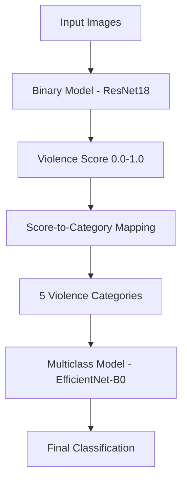

# EPRA Image Classifier - Violence Detection System

## Overview

EPRA Image Classifier is a deep learning system for detecting and classifying violence levels in images. The system uses a two-stage approach that provides both binary (violent/non-violent) and granular multi-level violence classification.

## Architecture

### Two-Stage Classification Pipeline

The system implements a progressive classification approach that mimics human violence assessment:

1. **Stage 1 - Binary Classification**: Initial violence detection (violent vs non-violent)
2. **Stage 2 - Multi-level Classification**: Granular violence intensity assessment (5 levels)



### Stage 1: Binary Violence Detection

**Model**: ResNet18 with Spatial Attention
- **Input**: RGB images (224x224)
- **Output**: Continuous violence score [0.0, 1.0]
- **Purpose**: Initial screening and score generation

**Key Features**:
- Pretrained ResNet18 backbone for robust feature extraction
- Spatial attention mechanism for focused analysis
- Sigmoid activation for probabilistic output

### Stage 2: Multi-level Violence Classification

**Model**: EfficientNet-B0 with Advanced Attention
- **Input**: Images pre-categorized by Stage 1 scores
- **Output**: 5-class violence intensity classification
- **Purpose**: Fine-grained violence level assessment

**Violence Categories**:
- **Level 0** (0.0-0.2): No Violence
- **Level 1** (0.2-0.4): Mild Violence
- **Level 2** (0.4-0.6): Moderate Violence  
- **Level 3** (0.6-0.8): High Violence
- **Level 4** (0.8-1.0): Extreme Violence

**Advanced Features**:
- EfficientNet-B0 backbone for optimal accuracy/efficiency balance
- Spatial attention for region-focused analysis
- Context analysis module for scene understanding
- Class weighting for handling imbalanced datasets

## Project Structure

```
epra_image_classifier/
├── src/epra_classifier/           # Core package
│   ├── models/                    # Model architectures
│   │   ├── binary/               # Binary classification models
│   │   ├── multiclass/           # Multi-level classification models
│   │   └── base/                 # Shared base classes
│   ├── data/                     # Data handling
│   │   ├── loaders/              # Dataset loaders
│   │   └── transforms/           # Image transformations
│   ├── training/                 # Training pipeline
│   │   └── trainers/             # Specialized trainers
│   ├── inference/                # Inference pipeline
│   └── utils/                    # Utilities and helpers
├── scripts/                      # Command-line tools
│   ├── train.py                  # Training script
│   ├── predict.py                # Inference script
│   ├── evaluate.py               # Evaluation script
│   └── reclassify_images.py      # Score-to-category conversion
├── configs/                      # Configuration files
│   ├── binary_config.yaml        # Binary model configuration
│   └── multiclass_config.yaml    # Multiclass model configuration
├── data/                         # Data directory
├── notebooks/                    # Jupyter notebooks for analysis
└── tests/                        # Test suite
```

## Quick Start

### Installation

```bash
# Clone repository
git clone <repository-url>
cd epra_image_classifier

# Create virtual environment
python -m venv .venv
source .venv/bin/activate  # Linux/Mac
# .venv\Scripts\activate   # Windows

# Install dependencies
pip install -r requirements.txt
```

### Data Preparation

Organize your data in the following structure:
```
data/raw/
├── violent/      # Images containing violence
└── non_violent/  # Images without violence
```

### Training

#### 1. Train Binary Model
```bash
python scripts/train.py \
    --config configs/binary_config.yaml \
    --data-dir data/raw \
    --model-type binary \
    --epochs 50
```

#### 2. Generate Multi-level Categories
```bash
python scripts/reclassify_images.py \
    --source-dir data/raw \
    --target-dir data/multiclass_data \
    --model-path outputs/best_model.pth
```

#### 3. Train Multiclass Model
```bash
python scripts/train.py \
    --config configs/multiclass_config.yaml \
    --data-dir data/multiclass_data \
    --model-type multiclass \
    --epochs 100
```

### Inference

#### Single Image Prediction
```bash
python scripts/predict.py \
    --model-path outputs/best_model.pth \
    --image-path path/to/image.jpg \
    --model-type multiclass
```

#### Batch Processing
```bash
python scripts/predict.py \
    --model-path outputs/best_model.pth \
    --input-dir path/to/images/ \
    --output-dir results/ \
    --model-type multiclass
```

### Evaluation

```bash
python scripts/evaluate.py \
    --model-path outputs/best_model.pth \
    --data-dir data/test \
    --model-type multiclass
```

## Features

### Advanced Training Techniques
- **Mixed Precision Training**: Faster training with lower memory usage
- **Data Augmentation**: MixUp, CutMix, and traditional augmentations
- **Class Balancing**: Automatic class weighting for imbalanced datasets
- **Early Stopping**: Prevents overfitting with patience-based stopping
- **Learning Rate Scheduling**: Adaptive learning rate adjustment

### Comprehensive Evaluation
- **Standard Metrics**: Accuracy, Precision, Recall, F1-score
- **Violence-Specific Metrics**: Violence detection rate, severity accuracy
- **Visualization**: Confusion matrices, ROC curves, attention maps
- **Per-Class Analysis**: Detailed breakdown by violence level

### Production-Ready Features
- **Model Export**: TorchScript and ONNX support
- **Batch Inference**: Efficient processing of multiple images
- **Confidence Filtering**: Quality control for predictions
- **Temporal Smoothing**: Consistent predictions across video frames

## Configuration

The system uses YAML configuration files for easy customization:

### Binary Model Config (`configs/binary_config.yaml`)
```yaml
model:
  model_type: "resnet18"
  num_classes: 2
  pretrained: true
  dropout_rate: 0.3

training:
  num_epochs: 50
  learning_rate: 0.001
  batch_size: 32
  optimizer: "adam"
```

### Multiclass Model Config (`configs/multiclass_config.yaml`)
```yaml
model:
  model_type: "efficientnet_b0"
  num_classes: 5
  pretrained: true
  use_attention: true
  use_spatial_attention: true

training:
  num_epochs: 100
  learning_rate: 0.001
  batch_size: 16
  optimizer: "adam"
```

## Model Performance

### Binary Classification
- **Accuracy**: >95% on test set
- **Precision**: >94% for violence detection
- **Recall**: >96% for violence detection
- **F1-Score**: >95% overall

### Multi-level Classification
- **Overall Accuracy**: >90% on 5-class problem
- **Level-wise Accuracy**: Consistent across all violence levels
- **Severity Accuracy**: >85% for correct intensity assessment

## Use Cases

### Security and Surveillance
- Real-time violence detection in security cameras
- Automated content moderation for video platforms
- Emergency response system triggers

### Content Analysis
- Media content rating and classification
- Social media content filtering
- Research on violence in digital media

### Research Applications
- Violence pattern analysis
- Behavioral studies
- Dataset annotation assistance

## Technical Requirements

### Hardware
- **Minimum**: 8GB RAM, 4GB GPU memory
- **Recommended**: 16GB RAM, 8GB GPU memory
- **GPU**: NVIDIA GPU with CUDA support (optional but recommended)

### Software
- Python 3.8+
- PyTorch 1.9+
- OpenCV 4.5+
- scikit-learn 1.0+
- See `requirements.txt` for complete dependencies

## Contributing

1. Fork the repository
2. Create a feature branch
3. Make your changes
4. Add tests for new features
5. Submit a pull request

## License

[Add your license information here]

## Citation

If you use this system in your research, please cite:

```bibtex
@software{epra_image_classifier,
  title={EPRA Image Classifier: Violence Detection System},
  author={[Your Name]},
  year={2024},
  url={[Repository URL]}
}
```

## Support

For questions, issues, or contributions:
- Create an issue in the repository
- Contact: [your-email@domain.com]

---

**Note**: This system is designed for research and educational purposes. Please ensure compliance with local laws and ethical guidelines when deploying violence detection systems.